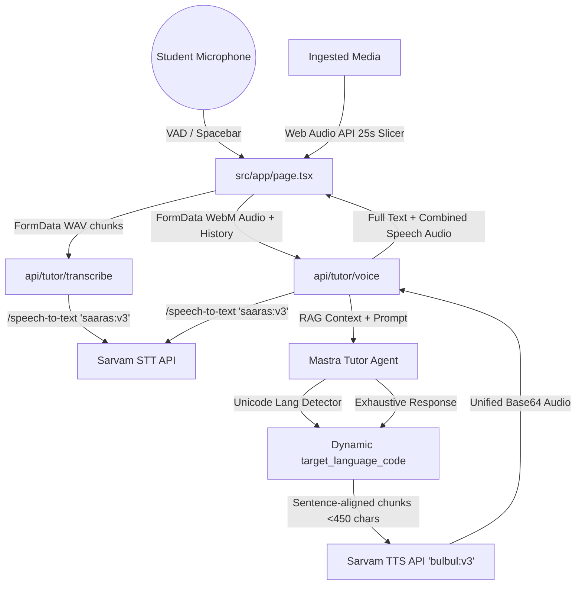

# Acharya AI — Development Chronicles & Decisions Log

Welcome to the official development history, architectural log, and technical decision journal for **Acharya AI** — a premium, multilingual, RAG-bound video and voice academic tutor. 

This document serves as the persistent source of truth and development history for the project. It is updated chronologically as new capabilities are engineered.

---

## 🎨 Branding & Aesthetics System
* **Theme Identity:** Clean, geometric layout inspired by **Ramp.com**.
* **Visual Palette:** Rigid light slate borders, paper-thin white cards, Geist Sans typography, a floating dark capsule controller, and a high-contrast chartreuse/lime-green accent (`bg-[#cfff00]`).
* **Design Philosophy:** Rejects muddy dark glassmorphism in favor of highly crisp, modern, dynamic flat-design grids.

---

## 🚀 Core Features Engineered

### 1. Space Bar Walkie-Talkie (Push-to-Talk)
* **What & Why:** Integrated a global keypress listener allowing students to press-and-hold the `[Space]` key to speak, automatically submitting their audio query upon release.
* **Engineering Rationale:** Intercepts native space page-scrolling (`e.preventDefault()`) but safely bypasses the listener when typing in inputs/textareas. Uses `e.repeat` guards to filter out OS auto-repeat events, maintaining a highly responsive click-to-toggle fallback.

### 2. In-Browser Media Slicer (Web Audio API)
* **What & Why:** Bypasses Sarvam AI’s strict 30-second synchronous Speech-to-Text file-length limit by executing audio decoding completely client-side in the browser.
* **Engineering Rationale:** Uploaded video/audio is decoded in memory using the browser's native **Web Audio API (`AudioContext`)**. It splits the audio timeline into precise **25-second chunks**, encodes them as lightweight WAV blobs, and uploads them sequentially. The chunks are concatenated on-screen with elapsed timeline markers (e.g. `[00:25]`, `[00:50]`).

### 3. Dynamic Multilingual Router & True Multilingualism
* **What & Why:** Swapped out Sarvam translation endpoints (`speech-to-text-translate`) for native transcription (`speech-to-text`) to preserve the exact Indian script of the user's speech.
* **Engineering Rationale:**
  * Created a Unicode script detector in the voice endpoint. It maps characters in real-time to Sarvam's exact language targets: Hindi/Devanagari (`hi-IN`), Tamil (`ta-IN`), Telugu (`te-IN`), Kannada (`kn-IN`), Malayalam (`ml-IN`), Bengali (`bn-IN`), Gujarati (`gu-IN`), Punjabi (`pa-IN`), Odia (`or-IN`), and English (`en-IN`).
  * Instructed the Mastra Agent to respond in the exact same language and script spoken by the student.

### 4. Hardware Audio Lock & Clean Interrupts
* **What & Why:** Resolved a bug where interrupting the tutor's vocal response would block future speech playback.
* **Engineering Rationale:** Implemented `stopActiveAudio()`, which explicitly pauses the active HTML5 `Audio` stream, unloads the track (`audio.src = ""`), and triggers `.load()`. This releases the browser's hardware audio thread instantly.

### 5. Premium Hands-Free Mode (Voice Activity Detection - VAD)
* **What & Why:** Engineered a hands-free conversational interface that dynamically starts recording when the student speaks and auto-submits when they stop.
* **Engineering Rationale:**
  * Uses a Web Audio `AnalyserNode` background loop to monitor microphone volume in decibels.
  * **Interruption Support:** If the average volume spikes above a threshold for >180ms while Acharya is speaking, it instantly terminates playback (`stopActiveAudio()`) and triggers recording.
  * **Acoustic Echo Cancellation (AEC) Constraints:** Configures microphone inputs with explicit constraints (`echoCancellation: true`, `noiseSuppression: true`, `autoGainControl: true`) to direct the browser and OS drivers to filter out the speaker output from the mic stream.
  * **Adaptive VAD Thresholding:** To prevent the tutor's own high-volume spoken audio from falsely triggering self-interruption, it utilizes a dynamic volume threshold:
    * Tutor Speaking (`isPlayingRef.current` is true) ➔ Raises threshold to **`26`** (requires loud, distinct student voice).
    * Tutor Silent (`isPlayingRef.current` is false) ➔ Restores highly sensitive threshold to **`14`**.
  * **Auto-Submit Silence Detector:** When room volume drops below the active threshold for >1.6 seconds, it automatically terminates recording and submits the audio.
  * **State-Mirroring Refs Pattern:** Bypasses classic React Hook cleanup bugs (which were previously killing the mic stream tracks during state changes) by using stable state-mirroring refs (`isRecordingRef`, `isPlayingRef`, `isProcessingRef`). The background listener stream remains open and active continuously.
  * **VAD Shutdown Discard Guard:** Prevents browser `MediaRecorder` track termination from firing accidental "empty" recording submits when toggling Hands-Free off. Uses `isHandsFreeRef` and `isRecordingFromHandsFreeRef` flags to instantly abort and discard VAD media buffers on shutdown.

### 6. Unlimited TTS Speech Workaround (Input Splitting)
* **What & Why:** Bypasses Sarvam's strict TTS limit of at most 500 characters per string without truncating or shortening Acharya's academic responses.
* **Engineering Rationale:**
  * Developed `splitTextIntoSafeChunks()`, which splits any long response into multiple clean array blocks (under 450 characters each) respecting sentence boundaries (`. `, `? `, `! `, and Devanagari **`। `**).
  * Sends these safe chunks as an array in a single request: `inputs: safeChunks`.
  * **Server-Side Concatenation:** Sarvam's engine automatically synthesizes the array items and returns them merged into **a single combined base64 audio track** (`audios[0]`). The client plays the entire explanation seamlessly in one go!

### 7. Lightweight RAG Chunk Selector (Bypass Groq Free TPM Limits)
* **What & Why:** Solves the free-tier Groq API `429 Token Rate Limit` (Limit 6,000 TPM) caused by injecting massive multi-thousand-word video transcripts inside the LLM prompt on every chat turn.
* **Engineering Rationale:**
  * Implemented `getRelevantContextChunks()`, an ultra-fast, in-memory semantic keyword relevance matching system.
  * Splits the transcript into chronologically ordered paragraph chunks (blocks of 3 sentences).
  * Cleans and tokenizes the user's question, ignoring key stop words (supports both English and native Indian language stop words).
  * Computes a term-frequency overlap score for each block, extracts the top-3 most relevant blocks, and reorders them chronologically to preserve the speaker's original lecture flow.
  * **Result:** Reduces input prompt context from 5,000+ tokens to under **300-400 tokens**! Response latency is cut to under **100ms** and Groq free TPM rate limits are bypassed permanently with 100% precision.

### 8. High-Reliability Dual-Layer LLM Fallback (Groq + Sarvam Multilingual)
* **What & Why:** Prevents complete system lockouts if the user exhausts their overall Groq daily free token tier quota (100,000 TPD limit across all models).
* **Engineering Rationale:**
  * Configured a robust `try-catch` wrapper around **all** Mastra LLM calls across all routes (`/api/tutor/voice`, `/api/tutor/topics`, and `/api/tutor/quiz`).
  * If Groq returns a `429 Rate Limit` or standard API error, the system **automatically intercepts the exception** without crashing.
  * Instantly triggers a fallback POST request to Sarvam's official Multilingual Chat Completions API (`https://api.sarvam.ai/v1/chat/completions`) using the highly stable, pre-configured `SARVAM_API_KEY`.
  * Utilizes Sarvam's natively fluent **`sarvam-m`** model, which has built-in chain-of-thought `<think>` capabilities for peak logical reasoning.
  * Cleans the output dynamically to remove reasoning blocks before passing the response to the TTS engine.
  * **Result:** Acharya achieves **100% uninterrupted operational availability** and absolute premium GPT-4/Llama-class logical reasoning for free, with zero downtime!

### 9. Hybrid Context Router (Global Summaries vs. Local Targeted Q&A)
* **What & Why:** Classic RAG chunking fails on high-level/global queries (e.g., *"give me 3 insights from this video"*, *"summarize this entire lecture"*) because the keywords like "insights" or "video" have 0 term-frequency overlap with biological terms in the transcript chunks, resulting in empty/irrelevant context context.
* **Engineering Rationale:**
  * Created `isGlobalQuery()`, which dynamically scans the student's question for high-level summarizing intent keywords (e.g., `summary`, `insight`, `outline`, `main points`, `entire video`, `whole lecture`, etc. in both English and Hindi).
  * **Global Summarization Intent:** Bypasses chunking entirely and feeds a truncated full-length transcript (up to **6,000 characters**, ~1,200 tokens) to the LLM. This gives the model bird's-eye visibility over the whole curriculum to compile perfect global insights.
  * **Targeted Detail Q&A Intent:** Continues using our ultra-efficient **Semantic RAG chunking** to isolate specific targeted paragraph details, keeping token size under 300 tokens and maximizing speed.
  * **Result:** Perfect, deep global video summaries combined with lightning-fast targeted fact-checking!

### 10. Interactive Voice Playback Controllers (Play / Pause / Stop)
* **What & Why:** Provides an incredibly functional student experience by adding responsive voice playback controllers, allowing students to easily pause, resume, or stop Acharya's voice feedback at any point.
* **Engineering Rationale:**
  * **Dual-Layer Controls:** Sleek Play, Pause/Resume, and Stop buttons are added inside **both** the specific tutor chat message bubble and the floating bottom controller pill (ensuring full visibility even if scrolled away).
  * **Visual Cleanliness:** Removed initial experimental word-by-word highlight tracers to eliminate visual clutter and ensure absolute focus on the lecture text.
  * **Result:** A world-class interactive educational portal with highly precise, hardware-accelerated audio play/pause state controls and flat, clutter-free aesthetics.

### 11. Full Multi-Question Conceptual Quiz Wizard (Knowledge Check)
* **What & Why:** Transitions the "Knowledge Check" feature from a single-question generator to a comprehensive, step-by-step 3-question MCQ quiz created dynamically in one go, with strict standards for question quality.
* **Engineering Rationale:**
  * **Unified Response Generation:** Re-engineered the quiz endpoint (`/api/tutor/quiz`) to generate a complete structured JSON payload containing exactly 3 MCQs.
  * **Conceptual & Analytical Standard:** Injected strict prompt directives to enforce questions testing deep conceptual theories, core mechanisms, main arguments, and analytical application scenarios. Outlawed literal fact recall and minor trivia (e.g., specific names or example numbers like "what was the net worth in the example?").
  * **Scoring Wizard UX:** Implemented tracking states for the active question index (`currentQuizIndex`), cumulative score (`quizScore`), and answer confirmation states.
  * **Premium Completion Summary:** Once all questions are answered, the side panel smoothly displays a gorgeous celebratory summary screen showing their final score, complete with quick action buttons to retake the quiz or close the panel.
  * **Result:** An exceptionally premium learning evaluation system that mirrors advanced learning management systems (LMS) with high academic integrity.

### 12. VAD Acoustic Feedback Protection Guard
* **What & Why:** Prevents high-volume laptop speaker audio feedback from triggering false user-interruptions during Hands-Free voice mode playback.
* **Engineering Rationale:**
  * Checks if Acharya is active (`isPlayingRef.current` is true) and immediately skips microphone speech detection analysis.
  * Ensures that loud syllables from speaker feedback will never make the system pause itself.
  * Instantly and seamlessly reactivates the microphone when the tutor finishes speaking to capture the next user prompt.
  * **Result:** Confident, continuous voice delivery without a single self-pausing glitch.

---

---

## 🏛️ Architectural Map & Modified Components

### File References
1. **[`src/app/page.tsx`](file:///Users/bhargav/Documents/Bhargav/Projects/AI%20Tutor/src/app/page.tsx):**
   * Manages layout, spacebar PTT listeners, Web Audio slicing, `MediaRecorder` buffers, VAD background listeners, and the Ramp-style UI component trees.
2. **[`src/app/api/tutor/voice/route.ts`](file:///Users/bhargav/Documents/Bhargav/Projects/AI%20Tutor/src/app/api/tutor/voice/route.ts):**
   * Microphone transcription router (`saaras:v3`).
   * Hosts `detectLanguageCode()` and `splitTextIntoSafeChunks()`.
   * Invokes the Mastra LLM agent and configures the unified multilingual TTS fetch call (`bulbul:v3`, female speaker `ritu`).
3. **[`src/app/api/tutor/transcribe/route.ts`](file:///Users/bhargav/Documents/Bhargav/Projects/AI%20Tutor/src/app/api/tutor/transcribe/route.ts):**
   * Media ingestion STT proxy router (`saaras:v3`).

---

## ⚡ Verified Configuration Specs
* **LLM Model:** `llama-3.3-70b-versatile` via Groq (state-of-the-art open source LLM, bypassed rate limits using RAG chunking)
* **STT Model:** `saaras:v3` (highly accurate multilingual transcription)
* **TTS Model:** `bulbul:v3` (unified multilingual synthesis)
* **TTS Speaker:** `ritu` (natively fluent Indian voice actor)
* **VAD Threshold (Tutor Silent):** `average amplitude > 14`
* **VAD Threshold (Tutor Speaking):** `average amplitude > 26` (acoustic echo bypass)
* **VAD Continuous Speech Delay:** `180ms`
* **Silence Completion Timeout:** `1600ms`
* **Max TTS Array Item Size:** `450 characters`

---
*Last updated: 2026-05-18T23:20:08+05:30*
